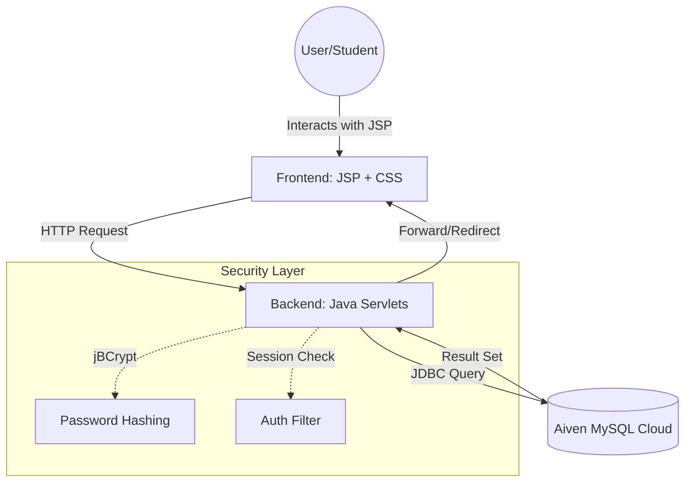

# CampusRetain — Digital Lost & Found Hub

<div align="center">


</div>

> A centralized web platform for educational institutions to manage lost and found items in real time.
<div align="center">

  
  <p><i>Admin Dashboard — Real-time item tracking and management</i></p>

  <br/>

  
  <p><i>Secure Login Page — Session-based authentication</i></p>

  <br/>

  
  <p><i>
  Claim lifecycle demonstrated in dashboard:  
  AVAILABLE → PENDING → CLAIMED → HANDOVER READY
  </i></p>

</div>


**🔗 Live Demo:** [campusretain.onrender.com](https://campusretain.onrender.com/)

---

## Overview

Campus lost-and-found management is broken — items sit in boxes, students never reclaim them, and staff track everything in paper registers. CampusRetain fixes this by digitizing the entire workflow into a real-time, secure web platform where students can report found items, submit claims, and coordinate handovers — all from a single interface.

---

## Features

- **Real-time Dashboard** — Live visibility of all reported items with dynamic status badges
- **Secure Claim Workflow** — Session-based authentication prevents unauthorized claims
- **Encrypted Contact Reveal** — Finder's contact details are only shared after claim approval
- **Glassmorphism UI** — Modern, responsive interface built with CSS3 and JavaScript
- **Admin Controls** — Manage the full item lifecycle from `AVAILABLE` → `RETURNED`

---

## Tech Stack

| Layer | Technology |
|---|---|
| Backend | Java Servlets (Jakarta EE 10+), Apache Tomcat 10 |
| Frontend | JSP, CSS3, JavaScript |
| Database | MySQL 8.0 (hosted on Aiven Cloud) |
| Security | BCrypt (jBCrypt), Session-based Access Control |
| Deployment | Render Cloud Platform |

---

## System Architecture



---

## Item Lifecycle
Report (AVAILABLE) → Claim (PENDING) → Approve (CLAIMED) → Handover (RETURNED)
1. **Report** — User posts a found item
2. **Claim** — Another user submits a claim
3. **Approve** — Finder approves the claim; contact details are revealed
4. **Handover** — Item is physically returned and marked `RETURNED`

---

## Project Structure
```text
CampusRetain/
├── src/java/com/lostfound/
│   ├── connection/      <-- JDBC & Database Logic (DBConnection.java)
│   └── servlets/        <-- Business Logic (Auth, Post, Claim, Approve)
├── web/
│   ├── index.jsp        <-- Main Dashboard (View)
│   ├── css/style.css    <-- Custom Glassmorphism UI
│   └── WEB-INF/         <-- web.xml, lib/ jars, and compiled classes/
└── .gitignore
```
---

## Security

- **Password Hashing** — jBCrypt; no plain-text passwords stored
- **Session Management** — Posting and claiming restricted to authenticated users
- **Transaction Safety** — SQL `COMMIT`/`ROLLBACK` ensures data integrity during claims

---

## Local Setup

### Prerequisites

- Java 21
- Apache Tomcat 10
- NetBeans 21 (recommended)
- MySQL or Aiven Cloud database

### Steps

```bash
git clone https://github.com/KadamAmruta03/CampusRetain.git
cd CampusRetain
```

1. Add `mysql-connector-j` and `jbcrypt` JARs to `WEB-INF/lib/`
2. Open the project in NetBeans and set the Java version to 21
3. Clean & Build to generate `WEB-INF/classes/`
4. Deploy on Tomcat 10
5. Open: `http://localhost:8080/CampusRetain`

---

## Cloud Deployment (Render + Aiven)

Set the following environment variables in your Render dashboard:

| Variable | Description |
|---|---|
| `DB_HOST` | Aiven service URI |
| `DB_PORT` | `24567` (Aiven default) |
| `DB_USER` | Database username (e.g., `avnadmin`) |
| `DB_PASS` | Database password from Aiven dashboard |

---

## Roadmap

- [ ] **Image Uploads** — Cloudinary integration for item photos
- [ ] **Email Notifications** — SendGrid alerts on claim approval
- [ ] **AI Matching** — Keyword-based algorithm to suggest matches between lost/found reports
- [ ] **Admin Analytics** — Dashboard for recovery rates, peak loss times, and category stats

---

## License

This project is open-source. Contributions are welcome.
