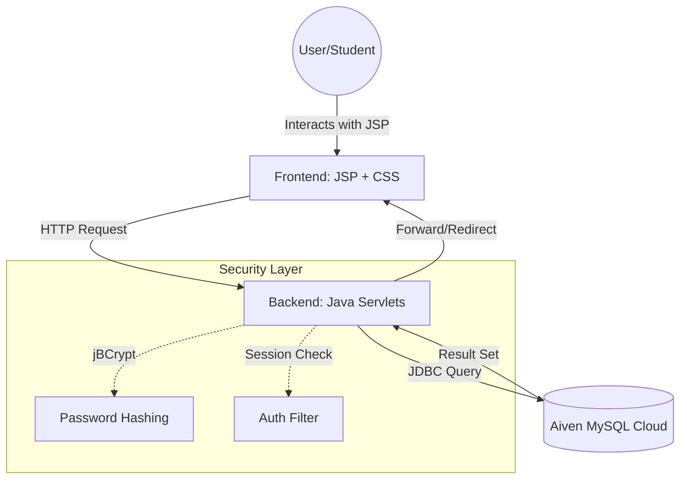

# CampusRetain: A Digital Asset Recovery Hub 

CampusRetain is a centralized web-based platform designed for educational institutions to manage "Lost and Found" items efficiently. It replaces manual registers with a real-time digital network, allowing students to report lost items, claim found items, and coordinate returns securely.

<div align="center">
  
  <p><i>Figure 1: Main Dashboard featuring Glassmorphism UI and Real-time Item Tracking.</i></p>
</div>

**Live Demo:** [https://campusretain.onrender.com/](https://campusretain.onrender.com/)

## Key Features
* **Real-time Dashboard:** Instant visibility of all reported found items with dynamic status badges.
* **Secure Claim System:** Integrated workflow to prevent unauthorized claims via session-based authentication.
* **Encrypted Communication:** Contact details are only revealed once a claim is approved by the original finder.
* **Responsive Glassmorphism UI:** A modern, high-performance interface built using CSS3 and JavaScript.
* **Administrative Control:** Ability to manage the entire lifecycle of an item from "Found" to "Returned."

## Tech Stack

- **Backend:** Java Servlets (Jakarta EE 10+), Tomcat 10
- **Frontend:** JSP, CSS3 (Glassmorphism), JavaScript
- **Database:** MySQL 8.0 (Hosted on Aiven Cloud)
- **Security:** BCrypt Password Hashing, Session-based Access Control
- **Deployment:** Render Cloud Platform

## System Architecture

## Project Structure & Directory Map
This project follows the standard Jakarta EE directory structure. Compiled `.class` files are included in the `WEB-INF/classes` directory to facilitate direct deployment on Render.

## Security Features
- **Password Hashing:** Uses `jBCrypt` to ensure no plain-text passwords are stored in the database.
- **Session Management:** Restricts access to posting and claiming items to logged-in users only.
- **Transaction Safety:** Uses SQL `COMMIT` and `ROLLBACK` to ensure data integrity during item claims.
- **Method Protection:** Custom `doGet` implementations to prevent `405 Method Not Allowed` errors during browser refreshes.

## Workflows (The "Circle of Life")
1. **Report:** User posts a found item (Status: `AVAILABLE`).
2. **Claim:** Another user claims the item (Status: `PENDING`).
3. **Approve:** The finder approves the claim (Status: `CLAIMED` - revealing contact details).
4. **Handover:** The item is physically returned (Status: `RETURNED`).

## Cloud Deployment (Render + Aiven)
To run this project in the cloud, the following Environment Variables must be configured in Render:
- `DB_HOST`: The Aiven service URI.
- `DB_PORT`: Typically `24567` for Aiven.
- `DB_USER`: Database username (default: `avnadmin`).
- `DB_PASS`: Secure password from Aiven dashboard.

## Installation
### Prerequisites
- Java 21  
- Apache Tomcat 10  
- NetBeans 21 (recommended)  
- MySQL / Aiven Database  

### Setup Steps

1. Clone the repository:
   ```bash
   git clone https://github.com/your-username/CampusRetain.git
   cd CampusRetain
   ```
2. Add mysql-connector-j and jbcrypt to WEB-INF/lib
3. Open in NetBeans
4. Set Java version to 21
5. Clean & Build
6. Deploy on Tomcat 10
Open:
```bash
http://localhost:8080/CampusRetain
```
5. Clean and Build to generate the `WEB-INF/classes` folder.
```text
CampusRetain/
├── src/                                 <-- Source Code Directory
│   └── java/
│       └── com/
│           └── lostfound/
│               ├── connection/
│               │   └── DBConnection.java       <-- Database logic (JDBC)
│               └── servlets/
│                   ├── LoginServlet.java       <-- Authentication logic
│                   ├── RegisterServlet.java    <-- User registration
│                   ├── PostItemServlet.java    <-- Reporting new items
│                   ├── ClaimServlet.java       <-- Item claim transactions
│                   ├── ApproveClaimServlet.java <-- Finder approval logic
│                   ├── DeleteServlet.java      <-- Post removal
│                   └── CompleteHandoverServlet.java <-- Final status update
├── web/                                 <-- Web Content Root
│   ├── index.jsp                        <-- Main Dashboard (Home)
│   ├── login.jsp                        <-- User Login UI
│   ├── register.jsp                     <-- User Registration UI
│   ├── css/
│   │   └── style.css                    <-- Custom Glassmorphism UI
│   ├── WEB-INF/
│   │   ├── web.xml                      <-- Deployment Descriptor
│   │   ├── lib/                         <-- External Libraries (.JAR)
│   │   │   ├── mysql-connector-j-9.x.x.jar
│   │   │   └── jbcrypt-0.4.jar
│   │   └── classes/                     <-- Compiled Bytecode (Auto-generated)
│   │       └── com/
│   │           └── lostfound/
│   │               ├── connection/
│   │               │   └── DBConnection.class
│   │               └── servlets/
│   │                   └── (All compiled Servlet .class files)
├── README.md                            <-- Documentation
└── .gitignore                           <-- Git exclusion file
```
## Future Enhancements (Roadmap)
* **Cloudinary Integration:** Implementing a robust media pipeline to allow users to upload and host actual images of found items for better verification.
* **Automated Email Alerts:** Integrating **SendGrid API** to notify users instantly when their claim is approved or when a matching item is reported.
* **AI-Driven Matching:** Developing a keyword-based matching algorithm to automatically suggest "Lost" reports to users who post "Found" items.
* **Admin Analytics Dashboard:** A high-level overview for campus administrators to track recovery rates, peak loss times, and category-wise statistics.


